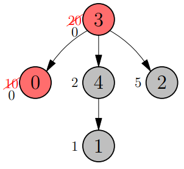

# Map of Tasks

## Informazioni sul progetto

- Formazione:

Algoritmi e Strutture Dati, SUPSI DTI 

- Studenti:

Alessi Gabriele, Bohrer Orlando

- Docenti:

Salani Matteo, Chiarabini Luca

- Deadlines:

Lunedì 19.12.2022 - Presentazione del progetto

Venerdì 20.01.2023 - Consegna documentazione e codice sorgente

## Analisi del problema

Viene fornita una mappa di dimensioni (N+1) x 2 di numeri interi rappresentante un albero di esercizi.
\
I primi due numeri rappresentano il totale di nodi dell’albero (N) e quanti nodi possono venire eliminati (C).
I restanti numeri, sempre in coppie di due, rappresentano i singoli nodi dell’albero e vengono numerati da 0 a N-1, in relazione alla riga della mappa in cui sono scritti, escludendo la prima che contiene le informazioni N e C.

<p align="center"></p>

Il primo valore rappresenta la posizione del nodo da risolvere prima di poter eseguire l’esercizio corrente. Il nodo di partenza ha valore -1, mentre gli altri hanno un valore compreso fra 0 e N.
\
Il secondo valore rappresenta il numero di ore richieste per completare l’esercizio e passare al successivo.
Nodi che appartengo a cammini diversi possono venire risolti in contemporanea.

<p align="center"></p>

Lo scopo dell’esercizio è di ottenere il tempo di risoluzione minimo degli esercizi.


## Progettazione

Prima di iniziare con lo sviluppo della soluzione è importante creare diagrammi e pseudocodici in modo da avere una visualizzazione iniziale delle proprie idee.

### Flowchart

In questo caso viene sviluppato innanzitutto un diagramma di flusso per capire come si comporta l'algoritmo in base alle diverse situazioni.

<p align="center"></p>

Il programma parte facendo una "scansione" dei dati ricevuti in input da parte dell'utente in modo da costruire in seguito la matrice di adiacenza del grafo.
\
Dopodiché si cerca di individuare i nodi foglia (gli ultimi compiti assegnati dal docente) per poi calcolare i rispettivi cammini per arrivare alla radice.
\
Quindi viene preso in considerazione il cammino di carico maggiore perché da questo verranno annullati i nodi più pesanti, così da calcolare infine il peso del grafo semplificato.

### Pseudocodice

Lo pseudocodice permette di avere una prima soluzione del problema senza dover scrivere effettivamente il codice sorgente. Questa versione semplificata serve per stendere l'algoritmo passo dopo passo e avere una visione generale delle funzioni che risolvono ogni piccola task.

Gli pseudocodici sviluppati si trovano in questo [link](Progettazione/pseudo.md).

## Implementazione

L'algoritmo che risolve il problema è stato sviluppato tramite linguaggio C, come richiesto dai docenti e dalla [piattaforma](https://training.olinfo.it) di riferimento per eseguire i test.

L'intestazione del documento con il codice sorgente contiene la dichiarazione delle librerie necessarie, i valori costanti e le variabili globali (input).

```c
#include <stdio.h>
#include <stdlib.h>

#define MAXN 10000
#define MAXC 100

int N, C, P[MAXN], T[MAXN];
```

La prima funzione implementata è stata quella di `ordinamento dei dati in input`, infatti quest'ultima permette di identificare prima di tutto la radice e poi di riorganizzare gli array.

```c
void sort(int P[], int T[], int N)
{
    int temp_P = P[0];
    int temp_T = T[0];
    for (int i = 0; i < N; i++)
    {
        if (P[i] == -1)
        {
            P[0] = P[i];
            T[0] = T[i];
            P[i] = temp_P;
            T[i] = temp_T;
        }
    }
}
```

La complessità della funzione è di **O(n)**.

Nel metodo `main` viene implementato il ciclo di vita principale del programma, dunque vengono messi insieme i vari algoritmi e funzione per generare la soluzione.

Inizialmente viene chiesto all'utente di inserire i dati di input necessari:

```c
printf("Inserisci prima N poi C: ");
scanf("%d %d", &N, &C);
printf("Inserisci le N cifre:\n");
for (int i = 0; i < N; i++)
    scanf("%d %d", &P[i], &T[i]);
for (int i = 0; i < N; i++)
    printf("%d %d\n", P[i], T[i]);
```

Il prossimo passo è l'istanziazione delle variabili locali di base e l'identificazione del nodo foglia tramite un semplice ciclo:

```c
 int max, total, leaf = 0;
    for (int i = 1; i < N; i++)
        if (P[i] > leaf)
            leaf = i;
```

Per il calcolo del cammino con peso maggiore vengono analizzati nuovamente i vettori contenenti i dati attraverso un for loop principale, dove si confrontano i tempi di risoluzione dei compiti nel nostro caso.
\
Dunque con un altro ciclo interno si calcola il totale delle ore impiegate fino ad arrivare alla radice, per poi ricavare il percorso massimo con un ultimo confronto.


```c
int index = P[0];
for (int i = 1; i < N; i++)
{
    if (P[i] > index)
    {
        index = P[i];
        total += T[i];
        while (index != -1)
        {
            total += T[index];
            index = P[index];
        }
    }
    P[i] = -2;
    if (total > max)
        max = total;
}
```

Per quanto riguarda la complessità di questo algoritmo si può osservare che sono presenti due cicli concatenati, quindi sarebbe di **O(n<sup>2</sup>)**.

## Test

Il codice finale non è ancora ottimale. Purtroppo, non siamo riusciti a creare una soluzione non greedy, né a ottenere dei risultati soddisfacenti sulla piattaforma dell’esercizio.

<p align="center"></p>

## Conclusioni

